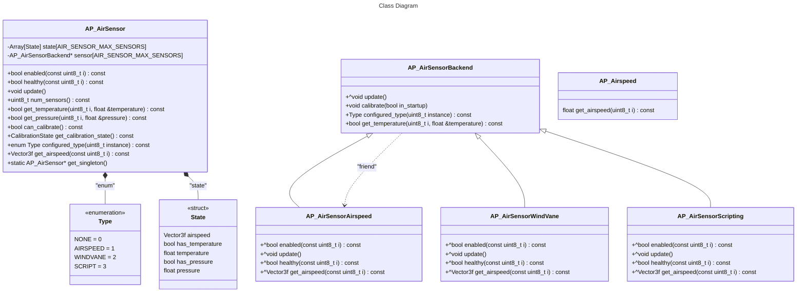

# ArduPilot Air Sensor Library

This library is an abstraction over the various air sensing libraries to provide a common interface for retrieving sensor data that describes the wind. In the future, 
it could provide other data such as temperature, humidity, tubulence, and adverse 
weather conditions such as rain, hail, fog that may impact flight safety.

# Architecture

This follows the battery monitor and GPS architecture with different types such as AP_Battery_Scripting.

